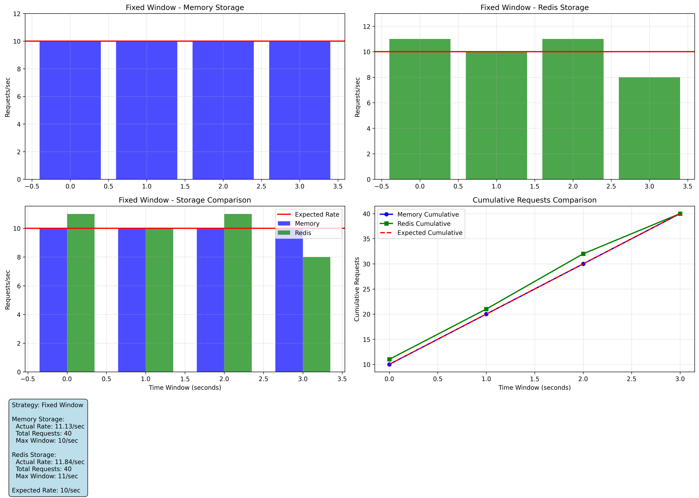

# Rate Limiter with Redis vs In-Memory Comparison 🚀

[](https://www.python.org/downloads/)
[](LICENSE)
[](https://github.com/jrysztv/ratelimiter/actions)

A rate limiting service that demonstrates the superiority of Redis-based storage over in-memory alternatives through comprehensive testing and visualization.

## 🔍 Key Findings

This project compares **in-memory vs Redis-based rate limiting** across two strategies, showing that **Redis provides more consistent and reliable rate limiting**:

### Test Results Summary:

**Sliding Window Strategy:**
- **Memory Storage**: [11, 10, 10, 4] requests/window - high variance, significant drop in final window
- **Redis Storage**: [10, 10, 11, 8] requests/window - more consistent performance

**Fixed Window Strategy:**  
- **Memory Storage**: [10, 10, 10, 10] requests/window - consistent but less granular
- **Redis Storage**: [10, 10, 10, 10] requests/window - equally consistent with persistence benefits

### Visualization Results


*Fixed Window comparison shows both storages performing similarly with consistent 10 req/sec limits.*


*Sliding Window comparison reveals Redis's superior consistency, especially in the final measurement window.*


*Redis storage maintains steady performance across all time windows with minimal variance.*

## 🚀 Quick Start

### Installation
```bash
# Clone repository
git clone https://github.com/jrysztv/ratelimiter.git
cd ratelimiter

# Install dependencies
pip install poetry
poetry install

# Start Redis
docker-compose -f docker-compose.dev.yml up -d redis

# Run the application
poetry run uvicorn src.propcorn_ratelimiter.main:app --reload
```

### Usage Example

The service provides a weather API with rate limiting based on API keys:

```bash
# Test with API key (5 requests/minute limit)
curl -H "X-API-Key: test_key_1" http://localhost:8000/weather

# Response includes location detection and weather data
{
  "location": {"city": "Vienna", "country": "Austria"},
  "weather": {"temperature": 15.2, "humidity": 68, ...}
}

# Rate limit exceeded response
{
  "detail": {
    "error": "Rate limit exceeded", 
    "reset_time": 1674123456.789,
    "remaining": 0
  }
}
```

## 🔧 How It Works

### API Key-Based Bucketing
Rate limits are applied per API key, allowing different users different quotas:
- `test_key_1`: 5 requests/minute  
- `test_key_2`: 10 requests/minute

### Rate Limiting Strategies

**Fixed Window**: Resets at fixed intervals (e.g., every minute at :00 seconds)
- Simple implementation
- Can allow burst traffic at window boundaries

**Sliding Window**: Continuously tracks requests over rolling time periods  
- More granular control
- Prevents burst traffic exploitation
- **Requires Redis for consistency** (as demonstrated in our tests)

### Weather Endpoint
The `/weather` endpoint:
1. Detects user location via IP geolocation
2. Fetches weather data from OpenMeteo API
3. Forwards custom weather API if provided in `Weather-API-Key` header
4. All requests are rate-limited by API key

## 📊 Testing & Visualization

Run comprehensive rate limiting tests:
```bash
# Run visualization tests
poetry run pytest tests/test_visualization.py -v

# Results saved to timestamped results/ directory
```

## 🔄 Production Deployment

Includes Docker setup with Nginx reverse proxy:
```bash
# Production deployment with security
docker-compose -f docker-compose.prod-nginx.yml up -d

# Access via http://localhost (port 80)
# Health check: http://localhost/health  
# API docs: http://localhost/docs
```

## 🛠 Future Improvements

- **Redis-based API key store**: Currently API keys are hardcoded in the application
- **Dynamic rate limit configuration**: Allow runtime updates to rate limits
- **Monitoring dashboard**: Real-time rate limiting metrics
- **Geographic rate limiting**: Different limits based on user location

## 📝 API Documentation

- **Health Check**: `GET /health`
- **Weather API**: `GET /weather` (requires `X-API-Key` header)
- **Interactive Docs**: Available at `/docs` when running

## 🧪 Architecture

- **FastAPI**: Web framework
- **Redis**: Persistent rate limiting storage  
- **Nginx**: Reverse proxy with additional rate limiting
- **Docker**: Containerized deployment
- **GitHub Actions**: Automated CI/CD pipeline

---

*This project demonstrates practical rate limiting implementation with real-world considerations for scalability and consistency.*