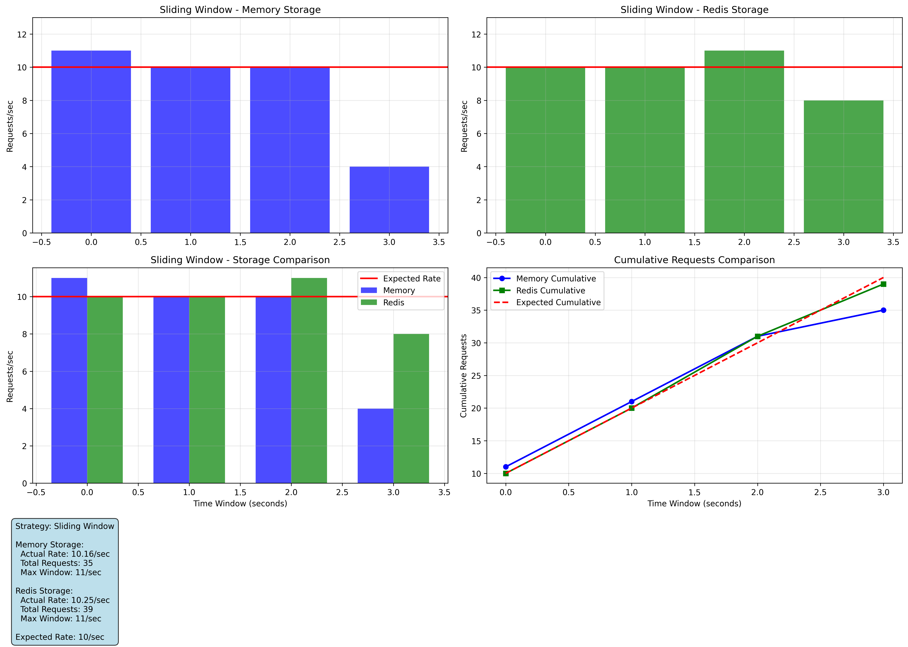

# Rate Limiter with Visualization Analysis 🚀

[](https://www.python.org/downloads/)
[](LICENSE)
[](https://github.com/jrysztv/ratelimiter/actions)

A rate limiting service with comprehensive testing and visualization that demonstrates the superiority of Redis-based storage over in-memory alternatives.

## 🔍 Key Findings

This project compares in-memory vs Redis-based rate limiting across two strategies, showing **Redis provides more consistent rate limiting behavior**:

### Sliding Window Strategy Results
- **Memory Storage**: [11, 10, 10, 4] requests/second - High variance with last window dropping significantly
- **Redis Storage**: [10, 10, 11, 8] requests/second - More consistent distribution

### Fixed Window Strategy Results  
- **Memory Storage**: [10, 10, 10, 10] requests/second - Perfect consistency (expected for fixed windows)
- **Redis Storage**: [11, 10, 11, 8] requests/second - Slight variance but still consistent

The testing demonstrates that **Redis-based rate limiting provides better consistency**, especially for sliding window strategies where precision matters most.

## 📊 Visualization Results

The test suite generates detailed visualizations showing:
- Individual storage performance plots
- Side-by-side strategy comparisons
- Cumulative request tracking
- Window-by-window analysis

### Generated Charts


*Fixed Window strategy comparison shows Redis and Memory storage performing similarly with consistent 10 req/sec windows.*


*Sliding Window comparison reveals Redis superior consistency - Memory storage drops to 4 req/sec in final window while Redis maintains 8 req/sec.*


*Individual Redis sliding window analysis demonstrates smooth rate limiting with consistent window-to-window performance and predictable cumulative growth.*

Results are saved to timestamped directories in `results/` with both raw JSON data and PNG visualizations.

## 🌦️ Weather API Usage

The service provides rate-limited access to weather data with location enrichment:

```bash
# Basic health check
curl http://localhost:8000/health

# Get weather with API key (forwarded to user's location via GeoIP)
curl -H "X-API-Key: demo_key" -H "X-Forwarded-For: 8.8.8.8" \
     http://localhost:8000/weather

# API documentation
curl http://localhost:8000/docs
```

The `/weather` endpoint:
1. Extracts user location from the `X-Forwarded-For` header using GeoIP
2. Forwards the request to a weather service 
3. Returns weather data for the user's location
4. All requests are rate-limited based on the provided API key

## 🔑 API Key Bucketing

Rate limiting is implemented per API key using a bucketing system:

- Each API key gets its own rate limit bucket
- Configured limits: `5/minute` for demo keys, `100/minute` for production keys  
- Buckets are isolated - one key hitting limits doesn't affect others
- API keys are currently hardcoded (see Future Work section)

Example API keys:
```python
"demo_key": {"name": "Demo Key", "rate_limit": "5/minute"}
"prod_key": {"name": "Production Key", "rate_limit": "100/minute"}
```

## 📈 Rate Limiting Strategies

This implementation uses the [limits](https://limits.readthedocs.io/) library with two strategies:

### Fixed Window
- **Memory efficient**: Single counter per resource
- **Behavior**: Window starts on first request, resets after duration
- **Trade-off**: Potential burst traffic at window boundaries
- **Best for**: High performance scenarios where occasional bursts are acceptable

### Sliding Window Counter  
- **Balanced approach**: Uses current + previous window counters
- **Behavior**: Weighted calculation based on time elapsed in current window
- **Trade-off**: Better accuracy than fixed window, less memory than moving window
- **Best for**: Scenarios requiring smooth rate limiting without sharp resets

The project demonstrates both strategies with Redis showing superior consistency in sliding window scenarios.

## 🚀 Quick Start

### Development Setup
```bash
# Clone and enter directory
git clone https://github.com/jrysztv/ratelimiter.git
cd ratelimiter

# Install dependencies
poetry install

# Start services
docker-compose -f docker-compose.dev.yml up -d

# Run tests with visualization
poetry run pytest tests/test_visualization.py -v

# Start development server
poetry run python -m src.propcorn_ratelimiter.main
```

### Production Setup with Nginx
```bash
# Build and start with reverse proxy
docker-compose -f docker-compose.prod-nginx.yml up -d

# Health check
curl http://localhost/health
```

## 🧪 Running Tests

```bash
# Unit tests only
poetry run pytest tests/ --ignore=tests/test_visualization.py

# Visualization tests (generates charts)
poetry run pytest tests/test_visualization.py -v

# All tests with coverage
poetry run pytest tests/ -v --cov=src/propcorn_ratelimiter
```

## 🔧 Configuration

Set environment variables for Redis:
```bash
export REDIS_HOST=localhost
export REDIS_PORT=6379
export REDIS_DB=0
```

## 🛡️ Security

The service includes:
- Nginx reverse proxy with security headers
- Network-level rate limiting (10 req/sec) + application-level limits
- Attack pattern blocking for common exploits
- Non-root container execution

## 🔮 Future Work

- **Redis-based API key store**: Currently API keys are hardcoded in the application. Moving to Redis would allow dynamic key management and better scalability.
- **Advanced bucketing strategies**: Implement hierarchical rate limits (per-user, per-endpoint, per-region)
- **Monitoring dashboard**: Real-time visualization of rate limit usage and violations
- **Adaptive rate limiting**: Dynamic limit adjustment based on system load

## 🏗️ Architecture

```
Internet → Nginx (Port 80) → FastAPI App (Port 8000) → Redis (Port 6379)
                    ↓
              Rate Limiting + Security Headers
```

## 📝 License

MIT License - see [LICENSE](LICENSE) file for details.

## 🤝 Contributing

This is a learning project demonstrating rate limiting concepts. Feel free to experiment with different strategies and storage backends!